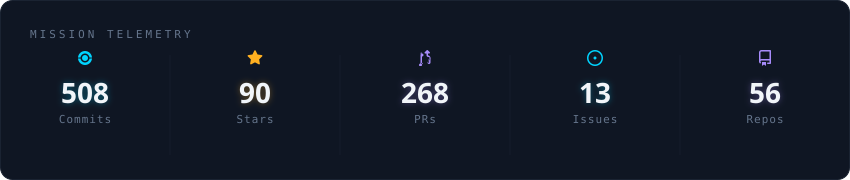

<div align="center">
  
</div>

<br/>

<div align="center">
  
</div>

<br/>

<div align="center">
  
</div>
<details>
<summary><strong>More about me</strong></summary>

<br/>

Building intelligent systems for healthcare. Passionate about biomedical machine learning, knowledge graphs, and AI automation.

**Research Interests**
- 🧬 **Biomedical Machine Learning**: Small-sample learning, model interpretation, SHAP analysis
- 🔗 **Knowledge Graphs**: Neo4j, graph-enhanced AI decision making
- 🤖 **Agent Workflows**: RPA, function calling, intelligent automation
- 📱 **WeChat Development**: Mini-program for healthcare services

**Contact**
- 📧 Email: [yi@yiharvest.dev](mailto:yi@yiharvest.dev)
- 🌐 Website: [yiharvest.dev](https://yiharvest.dev)

</details>

<br/>

<h2 align="center">Weekly Coding Activity</h2>

<!--START_SECTION:waka-->
**I'm a Daytime 🌆** 

```text
🌞 Morning                603 commits         ███░░░░░░░░░░░░░░░░░░░░░░   10.98 % 
🌆 Daytime                3786 commits        █████████████████░░░░░░░░   68.95 % 
🌃 Evening                998 commits         █████░░░░░░░░░░░░░░░░░░░░   18.18 % 
🌙 Night                  104 commits         ░░░░░░░░░░░░░░░░░░░░░░░░░   01.89 % 
```
📅 **I'm Most Productive on Friday** 

```text
Monday                   222 commits         █░░░░░░░░░░░░░░░░░░░░░░░░   04.04 % 
Tuesday                  471 commits         ██░░░░░░░░░░░░░░░░░░░░░░░   08.58 % 
Wednesday                779 commits         ████░░░░░░░░░░░░░░░░░░░░░   14.19 % 
Thursday                 470 commits         ██░░░░░░░░░░░░░░░░░░░░░░░   08.56 % 
Friday                   3294 commits        ███████████████░░░░░░░░░░   59.99 % 
Saturday                 178 commits         █░░░░░░░░░░░░░░░░░░░░░░░░   03.24 % 
Sunday                   77 commits          ░░░░░░░░░░░░░░░░░░░░░░░░░   01.40 % 
```


 Last Updated on 07/10/2026 21:19:08 UTC
<!--END_SECTION:waka-->

<br/>

<h2 align="center">Contribution Snake</h2>

<div align="center">
  <picture>
    <source
      media="(prefers-color-scheme: dark)"
      srcset="https://raw.githubusercontent.com/YiHarvest/YiHarvest/output/github-contribution-grid-snake-dark.svg"
    />
    <source
      media="(prefers-color-scheme: light)"
      srcset="https://raw.githubusercontent.com/YiHarvest/YiHarvest/output/github-contribution-grid-snake.svg"
    />
    
  </picture>
</div>

<br/>

<div align="center">
  <a href="mailto:yi@yiharvest.dev">
    
  </a>
  <a href="https://yiharvest.dev">
    
  </a>
</div>

<br/>

<p align="center">
  <samp>Thanks for visiting — let's build useful things.</samp>
</p>

<!-- Profile SVGs auto-generated by galaxy-profile -->
